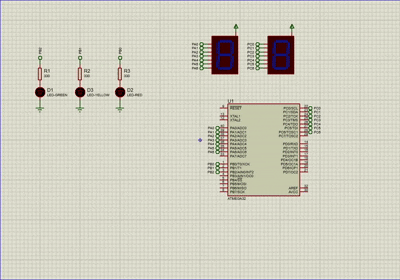

# 🚦 Embedded Traffic Light Controller
### Built with ATmega32 & Modular Embedded C Architecture
... (باقي التن
<div align="center">

# 🚦 Embedded Traffic Light Controller
### Built with ATmega32 & Modular Embedded C Architecture

[](https://www.microchip.com/)
[](https://en.wikipedia.org/wiki/C_(programming_language))
[](https://www.labcenter.com/)

</div>

---

## 📖 About The Project
A robust, modular, and scalable Traffic Light System firmware developed from scratch following industry standards. It implements a finite state machine (FSM) to control standard LED indicators alongside a real-time countdown timer rendered on dual 7-Segment displays.

---

## 📐 Architectural Design
The project adheres strictly to a **Layered Architecture (HAL Design Pattern)** to ensure high reusability and loose coupling:

* **Application Layer (`main.c`):** Handles system initialization and state transitions.
* **HAL Drivers:**
  * **DIO Driver:** Low-level register manipulation for pin and port configurations.
  * **LED Driver:** Source/Sink current configuration interface.
  * **7-Segment Driver:** Decimal digit splitting (Units & Tens) and multiplexed segment pattern mapping.

---

## ⏱️ Timing Specifications
* 🟢 **Green Light:** 15 Seconds
* 🟡 **Yellow Light:** 3 Seconds
* 🔴 **Red Light:** 15 Seconds

---

## 🛠️ Hardware & Tools
* **Microcontroller:** Microchip ATmega32 (8-bit AVR)
* **Peripherals:** Red, Yellow, Green LEDs with $330\Omega$ resistors, Dual Common-Anode 7-Segment Displays.
* **IDE / Toolchain:** Eclipse-based AVR Toolchain / AVR-GCC
* **Simulation:** Proteus ISIS

---

## 📂 Repository Structure
```text
├── DIO_Driver/         # Custom DIO peripheral drivers
├── 7_Segment_Driver/   # 7-Segment display interface logic
├── LED_Driver/         # LED control abstraction layer
├── Simulation/         # Proteus schematic workspace
└── main.c              # Application entry point & FSM loop
